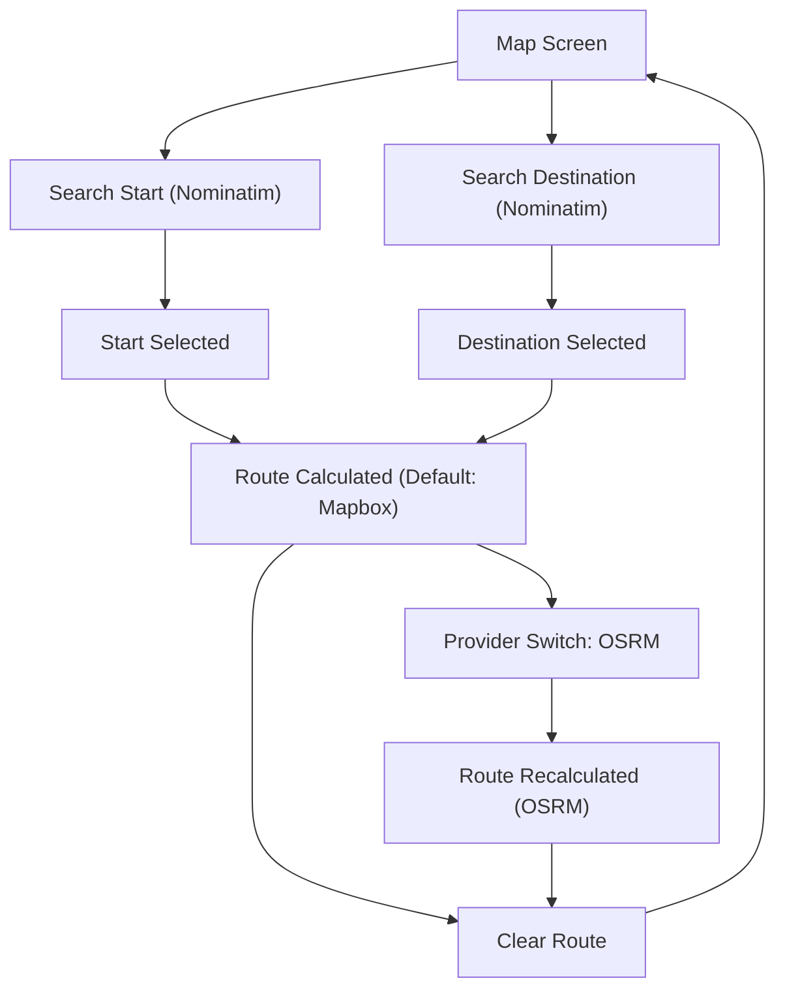

## 1. Product Overview
A dedicated Map screen that lets you search places and calculate routes.
It uses Mapbox for the map, Nominatim for autocomplete, and supports Mapbox/OSRM routing providers.

## 2. Core Features

### 2.1 Feature Module
Our requirements consist of the following main pages:
1. **Map Screen**: interactive Mapbox map, Nominatim place search autocomplete, origin/destination selection, route calculation, routing provider switch (default Mapbox, optional OSRM), route summary.

### 2.2 Page Details
| Page Name | Module Name | Feature description |
|-----------|-------------|---------------------|
| Map Screen | Map canvas | Render interactive Mapbox map with pan/zoom, user location (if permitted), and route overlay polyline. |
| Map Screen | Place search (Autocomplete) | Search for places via Nominatim and show suggestion list; select a suggestion to set a point on the map. |
| Map Screen | Route inputs | Set **Start** and **Destination** from search or map tap/pin; allow swapping start/destination; show current coordinates/place names. |
| Map Screen | Routing provider | Default routing to **Mapbox**; allow switching to **OSRM** (toggle/segmented control); re-calculate route when provider changes. |
| Map Screen | Route results | Display route geometry on map; show distance + duration summary; support clearing route and inputs. |
| Map Screen | Error/empty states | Show “no results” for autocomplete; show routing errors (network/provider failure); provide retry action. |

## 3. Core Process
User Flow:
1. You open the Map screen.
2. You search for a start location; you pick a suggestion from Nominatim autocomplete.
3. You search for a destination; you pick a suggestion.
4. The app calculates and renders a route using Mapbox routing by default.
5. You optionally switch the routing provider to OSRM; the route re-calculates and updates the route summary.
6. You clear the route to start over.

