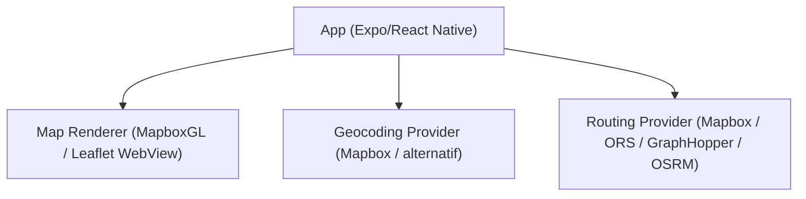

# Diskusi: Membuat screen pembanding Mapbox vs Leaflet + opsi routing gratis

## Ringkasan
Repo ini saat ini pakai **@rnmapbox/maps** untuk render peta native dan **Mapbox Geocoding + Directions API** untuk autocomplete, reverse geocode, dan routing (lihat `services/mapbox.service.ts`, `hooks/use-directions.ts`, `app/(tabs)/map.tsx`).
Tujuan dokumen ini: menilai kelayakan membuat **screen baru** berbasis **Leaflet** (tanpa menghapus/replace Mapbox screen), memilih **routing service gratis**, lalu menyusun rencana implementasi agar bisa dilakukan **perbandingan** dan dipresentasikan.

---

## 1) Kelayakan Leaflet untuk aplikasi ini (Expo/React Native)
### Fakta utama
- **Leaflet itu library peta web**. Di React Native, implementasi realistisnya adalah **Leaflet di WebView** (atau hanya untuk target `web`).
- Implementasi sekarang adalah **native map renderer** (MapboxGL) dengan kamera, marker, line layer, dan location puck.

### Dampak jika Leaflet via WebView (mobile)
**Yang membaik**
- Bebas dari vendor Mapbox untuk rendering.
- Ekosistem plugin Leaflet banyak (di web).

**Risiko/kompromi besar**
- **Performa & UX**: gesture/zoom/rotate + animasi kamera bisa terasa “web-in-webview”, terutama pada device low-end.
- **Integrasi lokasi**: perlu jembatan RN ↔ WebView untuk update lokasi, marker, dan polyline.
- **Offline & styling**: tergantung tile provider (OSM/dll). Styling vector setara Mapbox Style jauh lebih sulit bila hanya raster tiles.
- **Kompleksitas debugging**: dua runtime (RN + DOM) + bridge messaging.

### Kesimpulan feasibility
- **Untuk mobile (iOS/Android): Medium feasibility** bila diposisikan sebagai **screen pembanding/POC** (accept kompromi UX tertentu) dan scope fiturnya dibatasi.
- **Untuk web-only: High feasibility** (Leaflet/React-Leaflet sangat masuk akal).

> Catatan: untuk mobile native UX, alternatif yang biasanya lebih dekat ke Mapbox workflow adalah **MapLibre Native**. Namun untuk kebutuhan “screen pembanding”, Leaflet via WebView tetap masuk akal.

---

## 2) Opsi routing “gratis” (alternatif Mapbox Directions)
Kebutuhan saat ini (minimal):
- Input A/B → dapat koordinat (autocomplete/geocoding)
- Ambil **route geometry (LineString)** + **distance** + **duration**

### Kandidat layanan (hosted/free tier)
1. **OpenRouteService (ORS)**
   - Pro: routing cukup lengkap (profil, avoid, dll), ada free tier.
   - Kontra: ada rate limit; perlu key.
2. **GraphHopper**
   - Pro: hosted dengan free tier; routing matang.
   - Kontra: free tier terbatas; perlu key.

### Kandidat “gratis” tapi sebaiknya self-host / dibatasi
3. **OSRM (Open Source Routing Machine)**
   - Pro: open-source; cepat jika self-host.
   - Kontra: public demo server umumnya **bukan** untuk produksi; self-host butuh infra + data OSM.
4. **Valhalla**
   - Pro: open-source; fleksibel multi-profile.
   - Kontra: self-host relatif berat.

### Rekomendasi opsi paling praktis
- **MVP cepat**: ORS atau GraphHopper (hosted) karena paling sedikit kerja infra.
- **Skala/biaya jangka panjang**: self-host OSRM/Valhalla (kalau kamu siap operasi server + update data OSM).

Catatan: kalau kamu mengganti Directions, biasanya kamu juga perlu mengganti **Geocoding/Autocomplete** (mis. Nominatim/Photon/Pelias) agar benar-benar lepas dari Mapbox.

---

## 3) Rencana implementasi (minim risiko, bisa rollback)
### Prinsip
1. **Tidak mengubah Mapbox screen yang sudah ada**: jadikan itu baseline.
2. **Screen baru untuk Leaflet**: fokus pada pembanding yang apples-to-apples.
3. **Abstraksi layanan**: pisahkan “routing/geocoding service” dari UI agar bisa pakai provider gratis tanpa mengubah banyak UI.
4. **Feature parity minimum**: marker A/B, polyline rute, fitBounds, ETA/distance.
5. **Navigation selection**: di tab Map, tambah **sub-menu** untuk memilih screen (mis. “Mapbox” vs “Leaflet”).

---

## 4) Aturan pemisahan kode (Mapbox vs Leaflet)
Tujuannya: kamu bisa membaca dan membandingkan dengan cepat, tanpa “tercampur” dengan implementasi existing.

### Aturan utama
- **Mapbox baseline dianggap frozen**: tidak dipindah-pindah dulu, perubahan seminimal mungkin.
- **Leaflet hanya hidup di namespace/folder Leaflet**: screen, hooks, services, dan components dipisah.
- **Shared hanya untuk hal provider-agnostic**: tipe data netral, util murni (tanpa Mapbox/Leaflet dependency), dan UI atomik yang tidak tahu provider.

### Struktur folder yang disarankan (contoh)
- `app/(tabs)/map/`
  - `MapProviderMenuScreen` (sub-menu pilih Mapbox vs Leaflet)
  - `mapbox/MapboxMapScreen` (baseline)
  - `leaflet/LeafletMapScreen` (comparison)
- `src/map/`
  - `mapbox/` → `components/`, `hooks/`, `services/`
  - `leaflet/` → `components/`, `hooks/`, `services/`
  - `shared/` → `types.ts`, util netral

### Guardrail (biar tidak campur)
- `LeafletMapScreen` **tidak import** apa pun dari `src/map/mapbox/*`.
- `MapboxMapScreen` **tidak import** apa pun dari `src/map/leaflet/*`.
- Hanya `MapProviderMenuScreen` (atau navigator) yang boleh “tahu” dua screen.

### Phase 0 — Definisi pembanding (scope + KPI) (0.5–1 hari)
Output phase ini harus menghasilkan definisi “apa yang dibandingkan”:
- Feature checklist minimum yang wajib sama di Mapbox & Leaflet
- KPI pembanding (mis. first render time, interaksi pan/zoom, stabilitas route, error rate)
- Dataset/skenario demo untuk presentasi (mis. 3 rute tetap)

### Phase 1 — Inventaris baseline & kontrak data netral (1–2 hari)
- Buat tipe provider netral:
  - `PlaceSuggestion { id, placeName, center {lat,lng} }`
  - `DirectionsRoute { geometry(LineString), distanceMeters, durationSeconds }`
- Audit semua pemakaian Mapbox di:
  - `services/mapbox.service.ts`
  - `hooks/use-directions.ts`, `hooks/use-place-autocomplete*`
  - `app/(tabs)/map.tsx`

Catatan: audit ini fokus untuk tahu batas minimal yang harus disalin ke Leaflet screen tanpa refactor besar.

### Phase 2 — Pisahkan layanan routing dari UI (2–4 hari)
- Buat `services/routing.service.ts` yang expose `getRoute()`.
- Implementasi adapter:
  - `MapboxRoutingProvider` (existing)
  - `ORSRoutingProvider` atau `GraphHopperRoutingProvider`
- Update `useDirections` agar tidak langsung import `getDirectionsRoute` Mapbox.

### Phase 3 — Pisahkan geocoding/autocomplete dari UI (2–5 hari)
- Buat `services/geocoding.service.ts` yang expose `searchPlaces()` dan `reverseGeocode()`.
- Implementasi provider Mapbox (existing) + alternatif (opsional untuk tahap ini).

Pilihan strategi (diskusi):
- **A (lebih cepat)**: Leaflet screen tetap pakai geocoding Mapbox dulu, routing diganti ke ORS/GraphHopper.
- **B (lebih “clean”)**: Leaflet screen pakai geocoding alternatif juga (Nominatim/Photon/Pelias), jadi benar-benar vendor-independent.

### Phase 4 — Navigation untuk memilih provider (0.5–1 hari)
- Tambahkan sub-menu di tab Map untuk navigasi ke:
  - “Mapbox (Baseline)”
  - “Leaflet (Comparison)”

### Phase 5 — Screen Leaflet (WebView) untuk mobile (3–7 hari)
- Buat screen baru (mis. `LeafletMapScreen`) yang punya alur input/route sama dengan Mapbox.
- Buat `components/map/LeafletMapView.tsx` (WebView) dengan fitur minimal:
  - render tile, current location marker, marker A/B, polyline rute
  - bridge RN ↔ WebView untuk update state dan fitBounds
- Pertahankan Mapbox screen existing apa adanya.

### Phase 6 — Hardening + instrumentation pembanding (1–3 hari, bisa paralel)
- Metrics: waktu render awal, respons pan/zoom, error rate routing, waktu fetch route.
- Edge cases: permission denied, route not found, network slow, throttling/rate limit.
- Dokumentasi: batas rate limit, strategi caching, dan fallback.

### Phase 7 — Paket presentasi (0.5–1 hari)
- Buat template slide/outline hasil: KPI table, kesimpulan, rekomendasi.
- Siapkan demo script: 3 skenario rute yang sama dijalankan di Mapbox dan Leaflet.

---

## 5) Keputusan yang disarankan
- Untuk tujuan **perbandingan**: Leaflet feasible sebagai screen tambahan (WebView), selama scope dijaga dan KPI jelas.
- Untuk target **mobile native UX** jangka panjang: Leaflet kemungkinan kalah UX vs native renderer; opsi realistis biasanya tetap di jalur native (Mapbox/MapLibre) sambil mengganti routing/geocoding.

