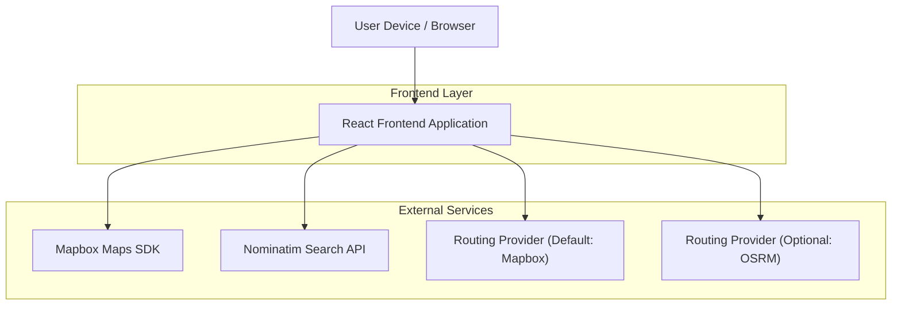

## 1.Architecture design

## 2.Technology Description
- Frontend: React@18 (or React Native) + Mapbox Maps SDK + TypeScript
- Backend: None

## 3.Route definitions
| Route | Purpose |
|-------|---------|
| /map | Dedicated screen with Mapbox map, Nominatim autocomplete, and routing provider switch (Mapbox default, OSRM optional). |

## 6.Data model(if applicable)
Not required (no persistent storage needed for basic routing/search flow).